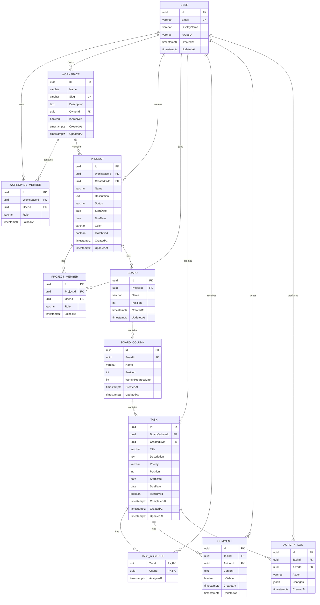

# Project Management App — Initial Database Design

## 1. Scope

This database design supports the first version of the project management app:

- User accounts and profiles
- Workspaces and role-based membership
- Projects and project membership
- One or more Kanban boards per project
- Configurable board columns
- Tasks, assignees, comments, and activity history

Attachments, notifications, labels, and checklists can be added in later sprints without changing the core relationships below.

## 2. Design conventions

- PostgreSQL is the target database.
- Primary keys use UUID values (`uuid` / C# `Guid`).
- Date and time values use UTC (`timestamptz` / C# `DateTimeOffset`).
- Table and column names below use `PascalCase` to match common EF Core conventions.
- Mutable business records include `CreatedAt` and `UpdatedAt`.
- Workspaces, projects, and tasks are archived instead of physically deleted.
- Membership and junction records use composite unique constraints to prevent duplicates.
- ASP.NET Core Identity may create additional authentication tables. `User` below represents the application user profile and can extend `IdentityUser<Guid>`.

## 3. Entity relationship diagram



## 4. Table definitions

### 4.1 User

Application profile associated with an authenticated account.

| Column | Type | Required | Notes |
|---|---|---:|---|
| `Id` | `uuid` | Yes | Primary key |
| `Email` | `varchar(320)` | Yes | Unique; normalize before comparison |
| `DisplayName` | `varchar(100)` | Yes | User-facing name |
| `AvatarUrl` | `varchar(2048)` | No | Optional profile image |
| `CreatedAt` | `timestamptz` | Yes | UTC creation time |
| `UpdatedAt` | `timestamptz` | No | UTC last-update time |

Authentication fields such as password hashes, lockout state, and security stamps should be managed by ASP.NET Core Identity.

### 4.2 Workspace

Top-level collaboration boundary and tenant for projects.

| Column | Type | Required | Notes |
|---|---|---:|---|
| `Id` | `uuid` | Yes | Primary key |
| `Name` | `varchar(150)` | Yes | Display name |
| `Slug` | `varchar(160)` | Yes | Globally unique URL-safe identifier |
| `Description` | `text` | No | Workspace summary |
| `OwnerId` | `uuid` | Yes | FK to `User.Id` |
| `IsArchived` | `boolean` | Yes | Default `false` |
| `CreatedAt` | `timestamptz` | Yes | UTC creation time |
| `UpdatedAt` | `timestamptz` | No | UTC last-update time |

Constraints:

- Unique index on `Slug`.
- The owner must also have an `Owner` record in `WorkspaceMember`.
- A workspace cannot be archived by a non-owner.

### 4.3 WorkspaceMember

Connects users to workspaces and stores their authorization role.

| Column | Type | Required | Notes |
|---|---|---:|---|
| `Id` | `uuid` | Yes | Primary key |
| `WorkspaceId` | `uuid` | Yes | FK to `Workspace.Id` |
| `UserId` | `uuid` | Yes | FK to `User.Id` |
| `Role` | `varchar(20)` | Yes | `Owner`, `Manager`, `Member`, or `Viewer` |
| `JoinedAt` | `timestamptz` | Yes | UTC membership time |

Constraints:

- Unique index on (`WorkspaceId`, `UserId`).
- Check constraint limiting `Role` to supported values.
- A workspace must always have exactly one owner.

### 4.4 Project

A managed body of work within a workspace.

| Column | Type | Required | Notes |
|---|---|---:|---|
| `Id` | `uuid` | Yes | Primary key |
| `WorkspaceId` | `uuid` | Yes | FK to `Workspace.Id` |
| `CreatedById` | `uuid` | Yes | FK to `User.Id` |
| `Name` | `varchar(150)` | Yes | Project name |
| `Description` | `text` | No | Project details |
| `Status` | `varchar(20)` | Yes | `Planned`, `Active`, `OnHold`, or `Completed` |
| `StartDate` | `date` | No | Planned start date |
| `DueDate` | `date` | No | Planned completion date |
| `Color` | `varchar(20)` | No | UI color, preferably a validated hex value |
| `IsArchived` | `boolean` | Yes | Default `false` |
| `CreatedAt` | `timestamptz` | Yes | UTC creation time |
| `UpdatedAt` | `timestamptz` | No | UTC last-update time |

Constraints:

- Check constraint: `DueDate` must be on or after `StartDate` when both exist.
- Check constraint limiting `Status` to supported values.
- Index on (`WorkspaceId`, `IsArchived`).

### 4.5 ProjectMember

Restricts project access to selected workspace members when needed.

| Column | Type | Required | Notes |
|---|---|---:|---|
| `Id` | `uuid` | Yes | Primary key |
| `ProjectId` | `uuid` | Yes | FK to `Project.Id` |
| `UserId` | `uuid` | Yes | FK to `User.Id` |
| `Role` | `varchar(20)` | Yes | `Manager`, `Member`, or `Viewer` |
| `JoinedAt` | `timestamptz` | Yes | UTC membership time |

Constraints:

- Unique index on (`ProjectId`, `UserId`).
- A project member must already belong to the project's workspace.

### 4.6 Board

Kanban board belonging to a project.

| Column | Type | Required | Notes |
|---|---|---:|---|
| `Id` | `uuid` | Yes | Primary key |
| `ProjectId` | `uuid` | Yes | FK to `Project.Id` |
| `Name` | `varchar(100)` | Yes | Board name |
| `Position` | `integer` | Yes | Display order; non-negative |
| `CreatedAt` | `timestamptz` | Yes | UTC creation time |
| `UpdatedAt` | `timestamptz` | No | UTC last-update time |

Constraints:

- Unique index on (`ProjectId`, `Name`).
- Unique index on (`ProjectId`, `Position`).

The application creates a default board whenever a project is created.

### 4.7 BoardColumn

A workflow stage such as Backlog, To Do, In Progress, Review, or Done.

| Column | Type | Required | Notes |
|---|---|---:|---|
| `Id` | `uuid` | Yes | Primary key |
| `BoardId` | `uuid` | Yes | FK to `Board.Id` |
| `Name` | `varchar(80)` | Yes | Column name |
| `Position` | `integer` | Yes | Display order; non-negative |
| `WorkInProgressLimit` | `integer` | No | Optional positive task limit |
| `CreatedAt` | `timestamptz` | Yes | UTC creation time |
| `UpdatedAt` | `timestamptz` | No | UTC last-update time |

Constraints:

- Unique index on (`BoardId`, `Position`).
- Check constraint: `Position >= 0`.
- Check constraint: `WorkInProgressLimit > 0` when supplied.

### 4.8 Task

A unit of work positioned in one Kanban column.

| Column | Type | Required | Notes |
|---|---|---:|---|
| `Id` | `uuid` | Yes | Primary key |
| `BoardColumnId` | `uuid` | Yes | FK to `BoardColumn.Id` |
| `CreatedById` | `uuid` | Yes | FK to `User.Id` |
| `Title` | `varchar(200)` | Yes | Short task title |
| `Description` | `text` | No | Markdown or plain text |
| `Priority` | `varchar(20)` | Yes | `Low`, `Medium`, `High`, or `Critical` |
| `Position` | `integer` | Yes | Order within a column; non-negative |
| `StartDate` | `date` | No | Optional start date |
| `DueDate` | `date` | No | Optional deadline |
| `IsArchived` | `boolean` | Yes | Default `false` |
| `CompletedAt` | `timestamptz` | No | Set when the task is completed |
| `CreatedAt` | `timestamptz` | Yes | UTC creation time |
| `UpdatedAt` | `timestamptz` | No | UTC last-update time |

Constraints:

- Check constraint: `DueDate` must be on or after `StartDate` when both exist.
- Check constraint: `Position >= 0`.
- Check constraint limiting `Priority` to supported values.
- Index on (`BoardColumnId`, `Position`).
- Index on `DueDate` for dashboard and overdue-task queries.

Task completion should not be inferred only from a column's name. A later version may add an explicit column category or task status if workflow reporting requires it.

### 4.9 TaskAssignee

Many-to-many relationship between tasks and assigned project members.

| Column | Type | Required | Notes |
|---|---|---:|---|
| `TaskId` | `uuid` | Yes | Composite PK; FK to `Task.Id` |
| `UserId` | `uuid` | Yes | Composite PK; FK to `User.Id` |
| `AssignedAt` | `timestamptz` | Yes | UTC assignment time |

Rules:

- An assignee must belong to the task's project.
- Composite primary key on (`TaskId`, `UserId`) prevents duplicate assignment.

### 4.10 Comment

Discussion entry attached to a task.

| Column | Type | Required | Notes |
|---|---|---:|---|
| `Id` | `uuid` | Yes | Primary key |
| `TaskId` | `uuid` | Yes | FK to `Task.Id` |
| `AuthorId` | `uuid` | Yes | FK to `User.Id` |
| `Content` | `text` | Yes | Comment body |
| `IsDeleted` | `boolean` | Yes | Default `false`; preserves conversation history |
| `CreatedAt` | `timestamptz` | Yes | UTC creation time |
| `UpdatedAt` | `timestamptz` | No | UTC last-edit time |

Constraints:

- Content must not be empty after trimming.
- Index on (`TaskId`, `CreatedAt`).

### 4.11 ActivityLog

Append-only audit history for important task changes.

| Column | Type | Required | Notes |
|---|---|---:|---|
| `Id` | `uuid` | Yes | Primary key |
| `TaskId` | `uuid` | Yes | FK to `Task.Id` |
| `ActorId` | `uuid` | No | FK to `User.Id`; null for system actions |
| `Action` | `varchar(50)` | Yes | Example: `TaskMoved` or `AssigneeAdded` |
| `Changes` | `jsonb` | No | Small before/after payload; never store secrets |
| `CreatedAt` | `timestamptz` | Yes | UTC event time |

Constraints:

- Index on (`TaskId`, `CreatedAt`).
- Activity records are never updated by normal application operations.

## 5. Delete behavior

| Parent relationship | Delete behavior | Reason |
|---|---|---|
| `User` → owned `Workspace` | Restrict | Ownership must be transferred first |
| `Workspace` → `WorkspaceMember` | Cascade | Membership has no meaning without its workspace |
| `Workspace` → `Project` | Restrict | Workspaces and projects should normally be archived |
| `Project` → `ProjectMember` | Cascade | Membership has no meaning without its project |
| `Project` → `Board` | Cascade | Boards are project-owned data |
| `Board` → `BoardColumn` | Cascade | Columns are board-owned data |
| `BoardColumn` → `Task` | Restrict | Move or archive tasks before deleting a column |
| `Task` → `TaskAssignee` | Cascade | Assignment is task-owned data |
| `Task` → `Comment` | Cascade | Comments are task-owned data |
| `Task` → `ActivityLog` | Cascade | Activity is task-owned data |
| `User` → authored records | Restrict | Preserve accountability; deactivate users instead |

Hard deletion of an entire workspace should be a separate privileged operation, not normal application behavior.

## 6. Authorization and integrity rules

Some rules span multiple tables and should be enforced in the application transaction because ordinary foreign keys cannot express them:

1. A project creator must belong to its workspace.
2. A project member must belong to the project's workspace.
3. A task creator and each assignee must belong to the task's project.
4. A user must not read or modify data outside their workspaces.
5. Only workspace owners can transfer ownership or archive a workspace.
6. Only owners and managers can manage membership and project configuration.
7. Viewers have read-only access.
8. Moving a task must update its column and position in a single transaction.
9. Reordering columns or tasks must avoid duplicate positions within the same parent.

Every query for tenant-owned data should include the authorized `WorkspaceId` boundary, directly or through joins. Never authorize access based only on a record ID supplied by the client.

## 7. Recommended EF Core enums

Use C# enums in the domain and store them as strings for readable database values:

```csharp
public enum WorkspaceRole
{
    Owner,
    Manager,
    Member,
    Viewer
}

public enum ProjectRole
{
    Manager,
    Member,
    Viewer
}

public enum ProjectStatus
{
    Planned,
    Active,
    OnHold,
    Completed
}

public enum TaskPriority
{
    Low,
    Medium,
    High,
    Critical
}
```

## 8. Default data

When a project is created, create one board with these columns in the same transaction:

| Position | Column name |
|---:|---|
| 0 | Backlog |
| 1 | To Do |
| 2 | In Progress |
| 3 | Review |
| 4 | Done |

Do not seed a permanent administrator account with a known password. Development demo users should be created only in the development environment, with credentials documented outside production configuration.

## 9. Later extensions

These are deliberately postponed until their owning sprint:

- `WorkspaceInvitation`
- `Label` and `TaskLabel`
- `Checklist` and `ChecklistItem`
- `Attachment`
- `Notification` and notification preferences
- `TaskDependency`
- Sprint planning entities
- Time tracking

Adding them later keeps the first migration small and prevents speculative schema complexity.

## 10. Sprint 0 database deliverables

Sprint 0 is complete for database design when:

- The ER diagram has been reviewed.
- Entity names and responsibilities are agreed upon.
- Primary keys, foreign keys, and unique constraints are documented.
- Delete behavior is explicitly configured in EF Core.
- UTC timestamp conventions are established.
- Workspace-level data isolation rules are documented.
- An initial migration can create the Identity schema plus the minimum required application tables.

